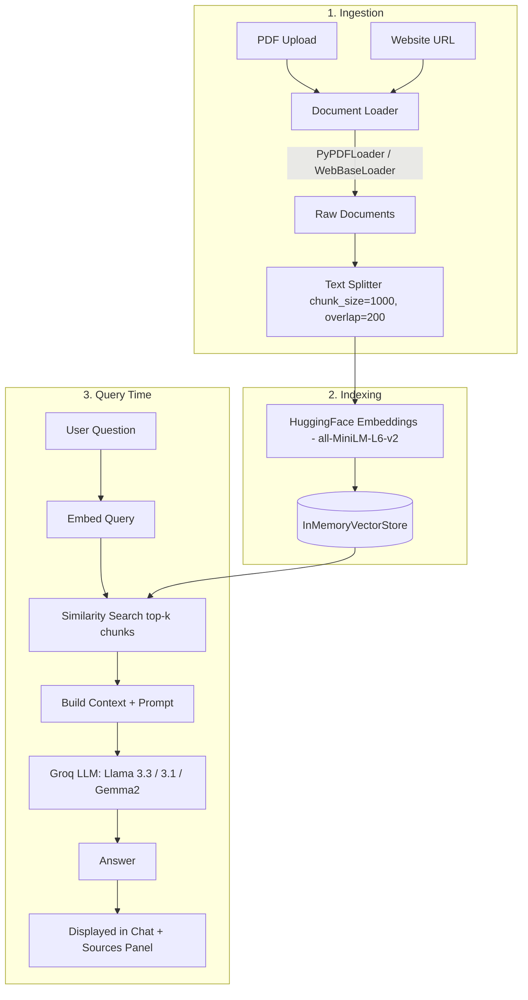

# 🤖 Multi-Source RAG Q&A ChatBot

A Retrieval-Augmented Generation (RAG) chatbot built with **Streamlit**, **LangChain**, **Groq (Llama 3.3)**, and **HuggingFace embeddings**. Upload PDFs or paste website URLs, and ask questions — the bot answers strictly from the content you gave it, and shows you exactly which source it used.

---

## 📌 Overview

Traditional chatbots (plain LLMs) can hallucinate or don't know about your private/local documents. This project solves that with **RAG**:

1. Your documents (PDF / website) are broken into small chunks.
2. Each chunk is converted into a numeric vector (embedding) and stored in a vector database.
3. When you ask a question, the system finds the most relevant chunks (semantic search) instead of sending your whole document to the LLM.
4. Only those relevant chunks + your question are sent to the LLM (Groq's Llama 3.3), which answers **grounded in your data** instead of guessing.

---

## ✨ Features

| Category | Feature |
|---|---|
| **Ingestion** | 📄 Upload multiple PDFs at once |
| | 🌐 Add any website URL as a knowledge source |
| | 🔗 Mix PDFs + websites in the same knowledge base |
| | 🚫 Duplicate-source detection (won't re-process the same file/URL) |
| **Retrieval & Generation** | 🧩 Automatic chunking (1000 chars, 200 overlap) for better context |
| | 🔍 Semantic similarity search (top-k configurable) |
| | 🧠 Strict "answer only from context" prompting — reduces hallucination |
| | ⚙️ Switch between 3 Groq models at runtime |
| | 🎚️ Adjustable temperature (creativity vs. factual) |
| | 🎚️ Adjustable `k` (how many chunks are retrieved per question) |
| **Transparency** | 🔎 "Sources used" panel under every answer (file name / URL + page number + snippet) |
| | 📊 Live counter of total indexed chunks & sources |
| **UX** | 💬 Persistent chat history within a session |
| | 📋 Sidebar list of all added sources |
| | ⬇️ Export full chat as a `.txt` file |
| | 🗑️ One-click "Reset All" to start fresh |
| | ⚡ Cached embeddings model (loads once, not on every rerun) |

---

## 🏗️ Architecture

### High-level flow



### Component responsibilities

```
+------------------------------------------------------------------+
|                        Streamlit UI Layer                        |
|  Sidebar (upload, settings)  |  Main Area (chat, source viewer)   |
+---------------------------+----------------------------------------+
                             |
+----------------------------v---------------------------------------+
|                     Application Logic (app.py)                     |
|  process_pdf() / process_website() / split_documents()             |
|  add_documents_to_store() / build_prompt()                         |
+------------+--------------------------------+----------------------+
             |                                |
+------------v---------------+      +---------v---------------------+
|   LangChain Loaders         |      |   LangChain Vector Store      |
|   PyPDFLoader                |      |   InMemoryVectorStore         |
|   WebBaseLoader               |      |   + HuggingFaceEmbeddings     |
+------------------------------+      +--------------------------------+
                                                 |
                                     +-----------v---------------------+
                                     |        Groq LLM API              |
                                     |  llama-3.3-70b-versatile, etc.   |
                                     +-----------------------------------+
```

### Why this design?
- **`InMemoryVectorStore`**: no external DB setup needed — fast to demo, resets on server restart (see "Future Improvements" for a persistent alternative).
- **`st.cache_resource` on embeddings**: the embedding model is loaded once per server process, not on every Streamlit rerun (Streamlit reruns the whole script on every interaction).
- **Strict prompt template**: forces the LLM to say "I couldn't find that information" instead of hallucinating when context is insufficient — a core RAG best practice.
- **Session state**: Streamlit has no built-in persistence between reruns, so `st.session_state` holds the vector store, chat history, and source list across interactions.

---

## 🧰 Tech Stack

| Layer | Technology |
|---|---|
| UI / Frontend | Streamlit |
| Orchestration | LangChain (`langchain-core`, `langchain-community`, `langchain-text-splitters`) |
| Embeddings | HuggingFace `sentence-transformers/all-MiniLM-L6-v2` |
| Vector Store | LangChain `InMemoryVectorStore` |
| LLM Provider | Groq API (`langchain-groq`) — Llama 3.3 70B / Llama 3.1 8B / Gemma2 9B |
| PDF Parsing | `pypdf` via `PyPDFLoader` |
| Web Scraping | `WebBaseLoader` (BeautifulSoup under the hood) |
| Env Management | `python-dotenv` |

---

## 📂 Project Structure

```
.
├── app.py               # Main Streamlit application (single-file app)
├── requirements.txt     # Python dependencies
├── .env.example         # Template for environment variables
├── README.md            # This file
└── INTERVIEW_PREP.md    # Deep-dive docs + interview Q&A
```

---

## 🛠️ Setup & Installation

```bash
# 1. Clone / copy the project, then create a virtual environment
python -m venv venv
source venv/bin/activate        # Windows: venv\Scripts\activate

# 2. Install dependencies
pip install -r requirements.txt

# 3. Configure your Groq API key
cp .env.example .env
# Open .env and paste your key:
# GROQ_API_KEY=gsk_xxxxxxxxxxxxxxxx

# 4. Run the app
streamlit run app.py
```

Get a free Groq API key at: https://console.groq.com/keys

---

## ▶️ Usage

1. Open the app in your browser (Streamlit prints a local URL, usually `http://localhost:8501`).
2. In the sidebar, go to the **PDF** tab and upload one or more PDFs, or the **Website** tab and paste a URL.
3. Click **Add PDF(s)** / **Add Website** — wait for the "added successfully" message.
4. Repeat for as many sources as you like — they all get combined into one searchable knowledge base.
5. Ask questions in the chat box at the bottom.
6. Expand **Sources used** under any answer to see exactly which chunk it came from.
7. Tune the model, temperature, or `k` in the sidebar anytime.
8. Use **Export Chat** to save the conversation, or **Reset All** to start over.

---

## ⚙️ Configuration Options (Sidebar)

| Setting | What it does |
|---|---|
| Groq Model | Swap between speed (8B), quality (70B), or an alternative family (Gemma2) |
| Temperature | 0 = deterministic/factual, 1 = more creative phrasing |
| k (chunks retrieved) | Higher k = more context sent to the LLM, but noisier and slower |
| Show sources toggle | Hide/show the citation panel under each answer |

---

## 🚧 Future Improvements

- **Persistent vector store** (Chroma / FAISS / Pinecone) so the index survives a server restart
- **Streaming responses** — show tokens as they're generated instead of waiting for the full answer
- **More loaders** — `.docx`, `.csv`, YouTube transcripts, plain text paste
- **Authentication** — per-user knowledge bases
- **Chat persistence** — save conversation history to a database (SQLite/Postgres) instead of only session memory
- **Re-ranking** — add a cross-encoder re-ranker on top of similarity search for higher precision
- **Answer caching** — cache repeated queries to save API calls

---

## 📄 License

Free to use and modify for learning and personal projects.